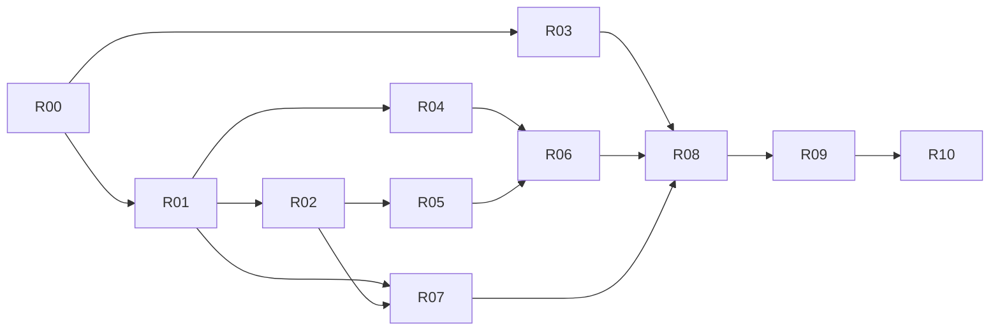

# Bench 2.0 最终路线图

本文件是 2.0 收尾的唯一跨模块执行清单。模块级约束和未完成项见 [modules/](./modules/README.md)，方向性取舍见 [DECISIONS.md](./DECISIONS.md)。已完成历史由 Git 保留。

## 发布契约

- 当前代码版本保持 `1.23.0`，只有 R00-R08 全部通过后才能执行 R09。
- 目标平台：macOS 14+ arm64、macOS 14+ x64、Windows 11 x64。Linux 不受支持，也不进入 CI/CD、构建或发布流程。
- Quick Launch、App Manager、Account Manager 必须在 macOS/Windows 保持相同核心语义；不支持的子能力返回 `partial/unsupported/failed`，不得伪装为空结果成功。
- Clean Space、Hardware、System Settings 维持 macOS-only；Windows 隐藏导航，直达路由显示 unsupported。
- 按 [D-010](./DECISIONS.md#d-010--默认使用-ad-hoc-macos-与-unsigned-windows-包) 默认生成 macOS ad-hoc 和 Windows unsigned 包。Apple notarization、Windows Authenticode 延期，不得伪装为已签名。
- Tauri updater minisign 不延期：三目标 updater bundle、`.sig`、`latest.json`、`SHA256SUMS` 和 `OS-SIGNING-NOTICE.txt` 缺一即停止。
- 云同步、AI Agent、TOTP、播放器、白噪音等新品类不进入 2.0。
- **Network Probe**（网络探测）按 [D-016](./DECISIONS.md#d-016--network-probe-独立一级模块与分期设计) **不进入 2.0 执行序列**；设计文档见 [modules/network-probe](./modules/network-probe/)，仅允许占位 feature，实现须在 2.0 收尾后另开指令。

平台状态：

| 模块            | macOS  | Windows | 2.0 剩余门禁                                         |
| --------------- | :----: | :-----: | ---------------------------------------------------- |
| Quick Launch    | 待验收 | 待验收  | 启动 smoke、500/2000 应用性能                        |
| App Manager     | 待验收 | 待验收  | inventory fixture、启动/更新/卸载 smoke、CI runner   |
| Account Manager | 待验收 | 待验收  | 区域 retry、分层、Keyring/WebView/Deep Link 真机矩阵 |
| System Settings | 待验收 | 不适用  | macOS read-after-write、权限拒绝、回滚               |
| Clean Space     | 待验收 | 不适用  | macOS 权限、受保护目录、timeout、取消、释放量        |
| Updater         | 待验收 | 待验收  | 真实 minisign、错误矩阵、1.23.0 升级/回滚            |

“待验收”只能在目标平台证据齐全后改为“通过”。编译成功、本机另一平台结果和文档声明都不能代替。

## AI 执行协议

后续 AI 每次只执行一个 Rxx，不得跳步或顺手开发远期 backlog。

1. 读取 `AGENTS.md` 的必读清单、当前 Rxx、涉及模块的 `README.md`、`design.md` 和 `roadmap.md`。
2. 检查前置任务已完成；没有证据时停止，不得自行勾选。
3. 先用失败测试或代码证据确认缺口，再做最小完整修复。IPC 变更必须同步 Rust、TS contract、typed wrapper、DTO 和测试。
4. 完成后运行该任务列出的命令；任一失败立即停止，不得修改测试来掩盖实现错误。
5. 将已完成项从模块 roadmap 移除；新长期约束写 design，新方向性取舍写 `DECISIONS.md`。
6. 证据保存到当前 PR/任务说明和对应 CI run artifact。日志必须脱敏，不提交 Cookie、token、密码、callback query、真实账号或生产数据。
7. 按以下固定格式报告，不得只说“已完成”：

```markdown
任务：Rxx
修改：文件与行为
自动化：命令、结果、测试数量
平台证据：OS/架构/运行时版本、场景、结果、CI URL 或 artifact 名称
文档：更新的 roadmap/design
剩余风险：无，或明确条目
```

全局停止条件：数据损坏、凭据泄露、跨账号污染、错误删除/更新、能力 fail-open、updater 签名失败、目标产物不完整、版本文件不一致。触发任一项时不得继续下一任务或创建发布。

## 执行顺序

| ID  | 状态 | 责任                 | 任务                                           | 前置     |
| --- | ---- | -------------------- | ---------------------------------------------- | -------- |
| R00 | [ ]  | AI                   | 冻结范围与记录基线                             | 无       |
| R01 | [ ]  | AI                   | Account Manager 代码收口                       | R00      |
| R02 | [ ]  | AI + 目标平台        | App Manager / Quick Launch fixture、启动与性能 | R01      |
| R03 | [ ]  | macOS 人工           | System Settings / Clean Space 真机验证         | R00      |
| R04 | [ ]  | macOS + Windows 人工 | Account Manager 真机验证                       | R01      |
| R05 | [ ]  | AI + CI              | Updater 错误矩阵与真实 minisign RC             | R02      |
| R06 | [ ]  | AI + 目标平台        | 1.23.0 升级、数据迁移与回滚                    | R04、R05 |
| R07 | [ ]  | AI + 人工复核        | 多 viewport、键盘、a11y 与视觉回归             | R01、R02 |
| R08 | [ ]  | AI + CI              | 全量回归与发布候选审计                         | R03-R07  |
| R09 | [ ]  | AI                   | 切换 2.0.0 与准备 Release PR                   | R08      |
| R10 | [ ]  | 仅发布负责人         | 批准并发布 v2.0.0                              | R09      |



## R00 冻结范围与基线

**代码修改**：否；只允许修正文档中的事实错误。

**步骤**：

1. 确认 `git status --short` 没有来源不明的改动。
2. 确认 `package.json`、`src-tauri/Cargo.toml`、`src-tauri/tauri.conf.json`、`.release-please-manifest.json` 都是 `1.23.0`。
3. 建立一个 2.0 收尾 PR 或 issue，复制 R00-R10 状态表；后续证据只挂到该入口和 CI artifact，不新建平行路线图。
4. 把模块 roadmap 中已完成项删除；远期项保留但本轮不得执行。

**禁止**：改为 `2.0.0`、创建 tag、扩大平台范围、增加新品类。

**命令**：

```bash
git status --short
pnpm run check:docs
pnpm run lint:fe
pnpm run test:critical
git diff --check
```

**证据**：版本四文件值、命令结果、当前 commit、收尾 PR/issue URL。

**完成条件**：基线全绿，范围和负责人已记录。否则停在 R00。

## R01 Account Manager 代码收口

**代码修改**：是。

**范围**：`src/features/account-manager/`、`src-tauri/src/account_manager/`、IPC 契约、i18n、相关测试、[模块 roadmap](./modules/account-manager/roadmap.md)。

**步骤**：

1. 为 Station、账号列表、详情、Auth Proxy 各区域补内联 error + retry；刷新保留旧数据，partial 不删除失败账号。
2. 按真实 owner 拆分超大 `commands.rs`、controller 和 dialogs；组件只收 props/callback，业务编排归 use-case/service，错误统一走 `parseCommandError/translateError`。
3. 保持 Session canonical map、revision、原子持久化、一次性 auth ticket、精确 origin 和 capability DTO 不退化。
4. 增加中英文切换、长文本、键盘/焦点、区域 retry、批量 partial 和 500+ 账号行为测试。
5. 删除模块 roadmap 中完成的代码项；真机项继续保留。

**禁止**：改 IPC 名称、保留新旧双写、创建纯转发空壳、把 `partial` 直接改为 `supported`、恢复 `encryptedFull`、让 Windows proxy 失败后直连或打开共享浏览器。

**命令**：

```bash
pnpm run lint:fe
pnpm exec vitest run src/features/account-manager
cargo test --manifest-path src-tauri/Cargo.toml account_manager
cargo clippy --manifest-path src-tauri/Cargo.toml -- -D warnings
pnpm run test:critical
```

**证据**：拆分前后职责表、测试结果、区域错误/partial 的中英文截图。

**停止条件**：Session/IPC 行为变化无迁移测试，或任何秘密进入前端 state/log/event。

## R02 App Manager 与 Quick Launch

**代码修改**：是。

**范围**：`src-tauri/src/app_manager/`、`src/shared/app-inventory/`、`src/features/{app-manager,quick-launch}/`、两模块测试与 roadmap。

**步骤**：

1. 提交 Windows fixture：Registry 32/64、EXE/MSI、UWP/MSIX/AUMID、CJK/空格路径；提交 macOS fixture：alias/symlink、外置卷、损坏 bundle、权限失败。
2. provider contract test 断言稳定 `appId`、source evidence、LaunchTarget、图标、去重、warning、revision 和 partial merge。
3. 在 Windows 验证 EXE/AUMID 启动、图标、winget/MSI、timeout 进程树回收、取消和权限拒绝。
4. 在 macOS 验证 `.app` 启动、Finder reveal、临时签名身份拒绝、ZIP/DMG 取消和 journal 恢复。
5. 用 0/1/50/500/2000 应用 fixture 验证虚拟 DOM 上限、搜索输入延迟、滚动、按需图标、刷新保留旧数据和取消。
6. 将平台行为测试接入对应 CI runner。

**禁止**：Quick Launch 新建扫描流程；renderer 传路径/URL/package ID/shell 参数；heuristic 授权升级/卸载；provider 错误返回成功空数组；Windows 使用 `cmd /C start`。

**命令**：

```bash
pnpm run lint:fe
pnpm exec vitest run src/features/app-manager src/features/quick-launch src/shared/app-inventory
cargo test --manifest-path src-tauri/Cargo.toml app_manager
cargo clippy --manifest-path src-tauri/Cargo.toml -- -D warnings
pnpm run test:critical
```

**证据**：fixture 清单、两平台 OS/架构、启动目标类型、smoke 结果、500/2000 项 DOM 数量与交互耗时、CI URL。

**停止条件**：同一 appId 映射到不一致目标、partial 删除旧数据、timeout 后残留进程树、破坏性操作缺 exact evidence。

## R03 macOS System Settings 与 Clean Space

**代码修改**：默认否；发现缺陷时回到 `/fix`，修复并重跑本任务。

**范围**：[System Settings roadmap](./modules/system-settings/roadmap.md)、[Clean Space roadmap](./modules/clean-space/roadmap.md)。

**步骤**：

1. 在全新 macOS 14+ 测试用户执行 Finder、截图、网络、Dock/系统开关、默认浏览器的 `read -> write -> read-after-write -> rollback`。
2. 对每项验证权限拒绝、unsupported、写入失败和重启后状态；失败不能显示为 off/成功。
3. Clean Space 覆盖权限拒绝、受保护目录、自定义目录、symlink escape、Docker/find timeout、取消、目录占用和只读文件。
4. 清理前后重新测量真实磁盘占用；总释放量只累计成功项，partial 保留失败项并可重试。

**禁止**：使用生产用户数据；删除未备份的测试目录；为通过测试放宽路径白名单；把估算大小当真实释放量。

**命令**：

```bash
pnpm run lint:fe
pnpm exec vitest run src/features/system-settings src/features/clean-space
cargo test --manifest-path src-tauri/Cargo.toml system_settings
cargo test --manifest-path src-tauri/Cargo.toml clean_space
cargo clippy --manifest-path src-tauri/Cargo.toml -- -D warnings
```

**证据**：macOS 版本/架构、每项原值/目标值/回读值/回滚值、权限错误码、清理逐项结果和前后字节数、脱敏截图。

**停止条件**：无法回滚系统设置、白名单外路径可删除、partial 被报告为 complete。未持有 macOS 真机时保持未完成，不得猜测结果。

## R04 Account Manager 双平台真机矩阵

**代码修改**：默认否；只有发现可复现缺陷时进入 `/fix`。

**范围**：[Account Manager 真机验收](./modules/account-manager/roadmap.md#真机验收步骤)。

**步骤**：严格按模块 roadmap 在全新 macOS 测试用户和 Windows Sandbox/VM 执行 Keyring、Cookie/Web Storage/IndexedDB、账号隔离、probe、批量 partial、Deep Link 冷/热启动、第二实例、删除 partial 和 Windows proxy fail-closed。

**禁止**：使用生产账号；记录秘密；用 dev server/browser preview 代替桌面 WebView；只改 capability 或文档；Windows proxy 失败后直连。

**命令**：

```bash
pnpm run lint:fe
pnpm exec vitest run src/features/account-manager
cargo test --manifest-path src-tauri/Cargo.toml account_manager
cargo clippy --manifest-path src-tauri/Cargo.toml -- -D warnings
```

**证据**：Bench commit、OS/WebView2 版本、capability DTO、模块 roadmap 每个场景的预期/实际、脱敏日志与截图。

**完成条件**：某项只在两个目标平台相关用例通过后才能把 capability 从 `partial` 提升为 `supported`；Windows `networkProxy` 继续 `unsupported`。

**停止条件**：跨账号可见、密文重启后不可解、Deep Link 重放成功、callback/origin 绕过、失败回退共享浏览器。

## R05 Updater、供应链与 RC 流水线

**代码修改**：是。

**范围**：`src/features/updater/`、`src-tauri/src/app_updater/`、`scripts/release/`、`.github/workflows/ci-build.yml`、[Updater roadmap](./modules/updater/roadmap.md)。

**步骤**：

1. 自动化覆盖损坏 JSON、缺目标、错误签名、404、离线、代理、磁盘满、取消、安装/重启失败；状态必须区分 failed/cancelled/partial。
2. 为 workflow 增加不会创建/更新 GitHub Release 的 RC dry-run 入口；只有正式 tag 且 R10 获批才允许发布副作用。
3. 使用真实 Tauri updater 私钥构建 macOS arm64/x64、Windows x64；聚合三目标 manifest 后生成并验证 `latest.json`。
4. 验证 installer、updater bundle、`.sig`、`OS-SIGNING-NOTICE.txt`、`SHA256SUMS` 数量与内容；任一缺失 fail-closed。
5. 保持 `BENCH_OS_SIGNING_MODE=unsigned`；不得要求不存在的 Apple/Windows 证书。

**禁止**：把私钥/PFX 写入仓库或日志；复用 updater 私钥做 OS 签名；签名失败后发布；RC dry-run 修改 GitHub Release。

**命令**：

```bash
pnpm run lint:fe
pnpm exec vitest run src/features/updater scripts/release
cargo test --manifest-path src-tauri/Cargo.toml app_updater
cargo clippy --manifest-path src-tauri/Cargo.toml -- -D warnings
pnpm run test:critical
```

**证据**：RC workflow URL、三个 target artifact 名、minisign 验证结果、`latest.json` 平台键、SHA-256 校验结果、未发生 Release 副作用的证明。

**停止条件**：secret 泄漏、签名不匹配、目标缺失、checksum 不一致、RC 创建了正式 Release。

## R06 1.23.0 升级、迁移与回滚

**代码修改**：可能；发现迁移缺陷时必须修复。

**范围**：所有持久化 repository、Account Manager snapshot/Keyring、Quick Launch overrides、设置、updater 和 `dev-prod-coexistence.md`。

**步骤**：

1. 建立脱敏 1.23.0 fixture，包含设置、账号 metadata、加密 Session、分类/覆盖和本地历史；列出 schema owner、版本、大小上限和失败策略。
2. 验证 `read old -> validate -> transform -> atomic write new -> publish memory`，重复启动必须幂等。
3. 覆盖缺字段、损坏 JSON/密文、只读目录、磁盘满、Keyring 拒绝、未来 schema 和迁移中断；旧数据仍可读取，不能半写。
4. 在 macOS/Windows 从已安装 1.23.0 经签名 updater 升级到 RC，验证数据、启动、取消、重启和卸载。
5. 使用备份或重新安装 1.23.0 完成回滚演练；2.0 数据不能被旧版本静默覆盖。

**禁止**：提交真实用户数据/密钥；未知 schema 自动重置；迁移失败后显示空数据成功；让 Dev/Prod 互相覆盖。

**命令**：

```bash
pnpm run test:critical
pnpm run test:be
pnpm run build:fe
pnpm run clippy:be
```

**证据**：fixture 说明、迁移前后 schema/hash、重复迁移结果、故障注入结果、两平台升级/回滚步骤与数据核对。

**停止条件**：任何数据丢失、密文不可解、迁移不幂等、旧版覆盖未来 schema。

## R07 UX、可访问性与视觉回归

**代码修改**：是。

**范围**：核心三条路径、全局对话框、i18n、测试配置。当前仓库没有 Playwright/axe 门禁，执行者必须补齐后再验收。

**步骤**：

1. 增加 Playwright 或等价项目，用 mock repository 渲染纯前端状态；覆盖 1024x768、1280x800、1440x900、Windows 125%/150% 等效 viewport。
2. 覆盖 Quick Launch 搜索/刷新/启动、App Manager 更新/partial、Account Manager 三栏/窄屏 Sheet、Updater 下载/取消/失败。
3. 每条路径覆盖 loading skeleton、refresh 保留旧数据、empty、failed/retry、partial、unsupported、cancelled、长中英文和语言切换。
4. 增加 axe 自动检查；人工验证 Tab 顺序、焦点恢复、Escape、icon-only accessible name、对话框 focus trap 和屏幕阅读器 smoke。
5. 截图 diff 必须人工查看；检查 overflow、重叠、空白截图和非预期布局位移，禁止无条件更新 baseline。

**禁止**：伪百分比、只有 spinner 的首载、把失败折叠为空态、用 viewport 缩放字号、无审查接受全部截图。

**命令**：

```bash
pnpm run lint:fe
pnpm run test:fe
pnpm run build:fe
# 执行者新增并记录项目实际的 e2e/a11y 命令；未加入 package.json 前不得勾选 R07。
```

**证据**：package script、CI URL、viewport/状态矩阵、截图 diff 审查、axe 报告、键盘与屏幕阅读器记录。

**停止条件**：核心路径存在不可达操作、文本遮挡、焦点丢失、高影响 a11y 错误或空白截图。

## R08 全量回归与发布候选审计

**代码修改**：只允许修复回归，不增加功能。

**步骤**：

1. 在 clean checkout 和冻结 lockfile 上运行完整验证；确认 pre-commit 覆盖删除/文档/格式/i18n/Rust 分流，CI 独立执行 `format:check`、`lint:fe`、Rust fmt/Clippy；macOS、Windows 两个 runner 全绿，平台门禁拒绝 Linux 配置。
2. 运行 R05 的 RC dry-run，下载并复核三目标产物、签名、manifest、notice、checksum，不发布。
3. 对照 R00-R07 证据和全部模块 roadmap；发布阻断项不得仍未完成，延期 OS 正式签名必须在 release notes 明示。
4. 检查日志无秘密、能力矩阵无夸大、所有相对链接有效、工作区无生成物或来源不明改动。

**命令**：

```bash
pnpm install --frozen-lockfile
pnpm run lint:fe
pnpm run test
pnpm run build:fe
pnpm run clippy:be
pnpm run verify
pnpm run check:docs
pnpm exec prettier --check "docs/**/*.{md,html}" README.md
git diff --check
```

**证据**：三平台 verify URL、RC artifact 清单、所有命令结果、未完成项审计结论。

**停止条件**：任何门禁失败、artifact 与 manifest 不一致、模块仍虚报支持、未解释的工作区改动。

## R09 切换 2.0.0 与准备 Release PR

**代码修改**：是，只允许版本和发布文档。

**步骤**：

1. 由 release-please 生成 Release PR，或按其配置同步修改 `package.json`、`src-tauri/Cargo.toml`、`src-tauri/Cargo.lock`、`src-tauri/tauri.conf.json`、`.release-please-manifest.json` 为 `2.0.0`。
2. 更新 `CHANGELOG.md` 和 Release notes：只列已验证能力，明确 macOS ad-hoc、Windows unsigned、Windows Account Manager proxy unsupported，且资产清单只有 macOS/Windows 目标。
3. 确认 bundle identifier 仍为 `com.bench.app`，WiX upgrade code 未变；不得借版本升级改持久化身份。
4. 重跑 R08。Release PR 保持未合并，交给 R10 人工批准。

**禁止**：手工创建 tag、合并 Release PR、修改 bundle identifier/WiX upgrade code、把延期项写成完成。

**证据**：五处版本一致、CHANGELOG、Release PR URL、R08 重跑结果。

**停止条件**：版本不一致、release notes 夸大支持、升级身份变化、R08 不再全绿。

## R10 人工批准与正式发布

**代码修改**：否。**只能由发布负责人执行；AI 到此必须停止并请求明确批准。**

发布负责人逐项确认：

- [ ] R00-R09 全部有证据，Release PR diff 只含预期版本与发布内容。
- [ ] GitHub updater 私钥 Secrets 可用；`BENCH_OS_SIGNING_MODE=unsigned` 与说明一致。
- [ ] 已接受 macOS Gatekeeper 手动信任、Windows Unknown Publisher 和正式 OS 签名延期。
- [ ] 已复核 `OS-SIGNING-NOTICE.txt`、`SHA256SUMS`、三目标 updater 和 `.sig`。
- [ ] 已决定是否接受仍保持 `partial/unsupported` 的非核心子能力；release notes 已准确写明。

只有负责人明确批准后才能合并 Release PR/创建 `v2.0.0` tag。tag workflow 任一 job 失败时不得手工上传残缺产物；修复后创建新的 RC/版本，不覆盖已下载的错误资产。

正式完成证据：tag、commit、GitHub Release URL、三平台 artifact、`latest.json` 签名验证、checksum、安装说明和发布后 updater 检查。
