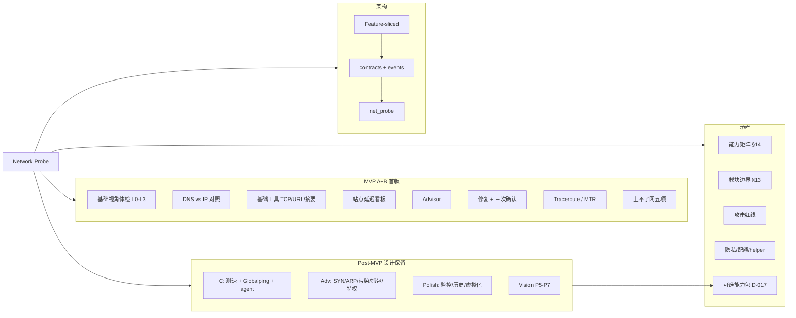

# Network Probe 知识图谱

> 能力 / 选型 / 决策 / 架构 / 护栏 / 路线的 Mermaid 总览。细节以 [design.md](./design.md) 为准。

---

## 1. 总览

---

## 2. 关键边

| 边          | 含义                                                            |
| ----------- | --------------------------------------------------------------- |
| MVP vs POST | 首版只交付 A+B；C/Adv/Vision **设计不删**                       |
| GUARD       | 矩阵驱动 UI；与 port-manager / diagnostics 边界清晰；检测非攻击 |
| PACK        | Adv 重能力按需 sidecar / 本机工具 / 远程；MVP 禁止下载墙        |
| ARCH        | 禁止组件直调 invoke；错误走 parseCommandError                   |

---

## 3. 已决决策（D-016 / D-017 / design §10）

1. 独立一级 feature
2. 当前设计整理、暂不实现
3. macOS 主路径；Linux 非目标
4. 高危三次确认
5. 测速/分布式 → Post-MVP-C
6. 多节点设计双路径；MVP 仅 local
7. Advisor 基础精简
8. MVP = A + B（含 §5.4 清单、DNS/IP 对照、§5.7 基础工具）
9. **可选能力包 D-017**：主包即用；Adv 可插拔；禁止运行时下 crate

---

## 4. L1 分册

| L1       | 文档                                                           |
| -------- | -------------------------------------------------------------- |
| 基础视角 | [design-basic.md](./design-basic.md)                           |
| 测试     | [design-test.md](./design-test.md)                             |
| 安全     | [design-security.md](./design-security.md)（含 Pack 安装向导） |
| 发现     | [design-discover.md](./design-discover.md)                     |

## 5. 场景用例

用户路径与 L2 覆盖矩阵：[scenarios.md](./scenarios.md)。

## 6. 默认资源

开箱名单（DNS / Captive / 公网 IP / 站点包）：[defaults.md](./defaults.md)。

## 7. Obsidian wikilinks（可选）

需要可点击图谱时再铺 `[[design]]` 等链接；默认保持通用 Markdown。
