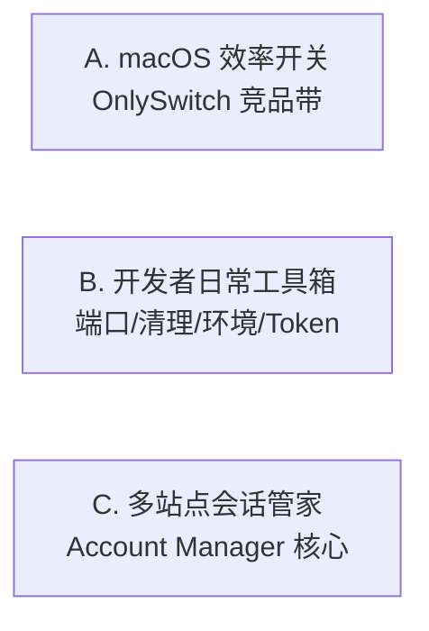

# Bench 产品迭代路线图评审

> 评审日期：2026-07-01 | 基线版本：v1.15.0  
> 范围：`docs/modules/` + `docs/roadmap/release-themes.md` + 已实现但未回写文档的改动

---

## 总评

**整体方向「还可以」，但更像「11 份模块待办清单 + 一份巨型候选库」，还不是一份可执行的产品路线图。**

模块级评估表（六维打分）质量很高，v1.16 偏修复/架构、v1.17 偏增强的分层也合理；Dev Toolbox 收拢侧边栏、托盘、危险操作二次确认、Token 实时汇率等近期交付，说明团队在补「桌面工具应有的壳层体验」。  
主要问题不在「缺功能」，而在 **产品叙事未收敛**、**路线图与实现不同步**、**feature-candidates 与 module roadmap 两套体系未对齐**，容易在 v1.17 后再次功能膨胀。

**结论：方向对，需要一次「主计划层」整理，而不是继续堆模块 checkbox。**

---

## 做得好的地方

| 维度 | 说明 |
|------|------|
| **信息架构** | 侧边栏 v2（Quick Launch / App / Hardware / Terminology / Account / Dev Toolbox / Settings）清晰；开发类工具收进 Tab，降低认知负担 |
| **差异化押注** | Account Manager 投入最重（Session / AuthProfile / 外部登录代理），与 OnlySwitch 类工具形成差异，而非纯 defaults 开关合集 |
| **质量意识** | 各模块六维评估 + bug 文档体系；Port Manager / App Manager 测试覆盖是正面样板 |
| **UX 基建** | 危险操作确认（E5）、托盘（P4）、System Settings 窗口聚焦刷新（对齐 OnlySwitch）—— 都是「长期复利」型体验 |
| **版本节奏直觉** | v1.16 修债、v1.17 加能力、v1.18 做远期，比「全模块同时加功能」健康 |

---

## 产品方向：需要明确的 North Star

当前 Bench 同时承载三条用户故事，路线图未声明优先级：



| 故事 | 典型用户 | 竞品 | 路线图现状 |
|------|----------|------|------------|
| A | macOS 重度用户 | OnlySwitch, Raycast 插件 | `feature-candidates` 24 节，但 System Settings roadmap 只列 i18n/组件债 |
| B | 日常写代码的人 | DevUtils, iTerm 插件 | Dev Toolbox 已成型，roadmap 部分条目过时 |
| C | 多账号运营/开发 | 1Password + 浏览器配置 | 技术债最重，是唯一有工期估算的模块 |

**建议对外叙事（选一为主、两为辅）：**

> **主定位：macOS 上的开发者工作台** — 一键启动、环境/端口/清理、系统调优；  
> **副定位 1：多站点账号会话** — 差异化护城河；  
> **副定位 2：术语/硬件等垂直工具** — 保留但不扩品类。

`feature-candidates.md` 里 R（播放器）、X（AI Agent）、W（TOTP）等与主叙事弱相关，应明确为 **「不做 / 远期 / 社区插件」**，避免稀释。

---

## 用户体验：路线图层面的缺口

### 1. 文档与实现不同步（损害信任）

| 文档声称 | 实际状态 |
|----------|----------|
| Account Manager v1.16：组件直调 api、无 store/use-cases | 架构重构已完成（store / repository / use-cases） |
| Dev Toolbox v1.17：JSON/Base64/时间戳 | 已在 `dev-toolbox/page.tsx` 内联实现 |
| Token Calculator v1.17：联网定价/汇率 | Frankfurter 实时汇率 + 缓存已上线 |
| Account Manager v1.16：DetailColumn 硬编码中文 | 需 grep 验证是否仍残留 |

**UX 影响：** 团队对「还剩多少债」判断失真，v1.16 会被重复做或永远打不完勾。

**动作：** 发 v1.16 前做一次 **roadmap audit**（半天），已完成的打 ✅ 并写一行「shipped in v1.15.x」。

### 2. 横切体验债未打包成「一个主题」

i18n、重入保护、空状态/加载态、大列表虚拟化、测试门禁 —— 分散在 6+ 模块 v1.16，用户感知是「哪都还有点糙」，而不是「这一版明显更 polish」。

**建议：** v1.16 对外主题定为 **「Polish & Trust」**，用用户可感知条目验收：

- 全应用无硬编码中文/英文漏网
- 所有 destructive / kill / 卸载 有后果说明（已部分完成）
- Account Manager / Quick Launch 无连点双提交
- 空列表、加载中、失败可重试 三态齐全（至少 Account Manager + System Settings）

### 3. 可发现性规划偏晚

System Settings **设置搜索** 放在 v1.18；随着 `feature-candidates` 中 A–F 等开关入库，没有搜索会迅速恶化 UX。  
Dev Toolbox 7 Tab 已接近上限，再往里塞工具需要 **分组或二级导航**，而非继续平铺 Tab。

### 4. Account Manager 学习曲线

功能完备但 UX 评分普遍 ⭐⭐⭐ — 缺 onboarding、状态语义（Session TTL / 探针结果 / 代理状态）的统一说明。  
v1.17 的 IndexedDB 导出、TTL 清理是 **技术正确**；用户更需要 **「我的登录还有效吗？」一眼看懂** 的状态设计。

### 5. 测试与 UX 质量未挂钩

Quick Launch / System Settings / Terminology / Dev Toolbox **零测试** 仍规划 v1.17 新功能。  
从 UX 角度，Quick Launch「连点启动两次」比「使用频率统计」更伤口碑 — v1.16 重入保护优先级正确，应 **测试门禁后再加功能**。

### 6. 跨平台预期管理

README 写 cross-platform，路线图几乎全是 macOS。Account Manager v1.18 才提 Windows/Linux WebView — **产品层应写清**：非 macOS 是「部分模块可用」还是「未来目标」，避免 Windows 用户进 Account Manager 踩坑。

---

## feature-candidates.md：方向对，但需要「选品规则」

当前 24 节（A–X）是优秀 **技术预研库**，不是路线图。问题：

- 与 `system-settings.md` v1.16–v1.18 **无映射**
- 低/中/高复杂度分类有了，但 **无 RICE / 无与主定位的契合度**
- 大量 OnlySwitch 平替（媒体控制、AI Agent）会拖慢 **开发者工作台** 叙事

### 建议保留并纳入 System Settings 近期（与主定位一致）

| 优先级 | 候选节 | 理由 |
|--------|--------|------|
| P1 | C 键盘（自动纠正/智能引号） | 开发者刚需，纯 defaults，低成本 |
| P1 | B Dock 剩余 + Q 隐藏桌面图标 | 与已有 Dock/桌面能力一致，托盘用户常用 |
| P2 | G 维护工具（purge、字体缓存） | 与现有「维护」区块自然合并 |
| P2 | H 迷你监控（CPU/内存） | 可进 Dev Toolbox「系统信息」Tab 增强 |
| P3 | N 剪贴板历史 | 高频，但复杂度高，单独评估 |

### 建议明确延后或不做（至少 v1.20+）

| 节 | 理由 |
|----|------|
| R 播放器 / T 白噪音 | 与开发者工作台弱相关 |
| X AI 自然语言控制 | 高复杂度 + 安全/隐私 + 维护成本 |
| W TOTP/密码管理 | 与 1Password 正面竞争，非核心 |
| S 隐藏刘海 / 屏幕坏点 | 小众，OnlySwitch 长尾功能 |

---

## 推荐：按「发布主题」重组 v1.16–v1.18

> 保留各模块 `roadmap.md` 作 **技术 backlog**；**`docs/roadmap/release-themes.md`** 作 **唯一发布节奏源**。

### v1.16 — Polish & Trust（4–6 周，用户可感知）

| # | 主题项 | 主要模块 | 成功标准 |
|---|--------|----------|----------|
| 1 | 全量 i18n 清扫 + 路线图 audit | System Settings, Account Manager, Quick Launch | `lint:fe` i18n guard 0 违规；roadmap 与代码一致 |
| 2 | 异步重入 + 危险操作统一 | Quick Launch, Token Calculator, Account Manager | 连点无重复副作用；E2E 手测清单通过 |
| 3 | Account Manager 状态可读性 | Account Manager | Session/探针/代理三态有文案+颜色+空态 |
| 4 | System Settings 体验债 | System Settings | shadcn Select、加载失败 toast、聚焦刷新验证 |
| 5 | 文档 truth | 全部 roadmap | 已实现项 ✅；删除重复/过时条目 |

**刻意不做：** feature-candidates 大批量上新、Account Manager TLS/跨平台。

### v1.17 — Developer Daily Loop（6–8 周）

| # | 主题项 | 主要模块 | 成功标准 |
|---|--------|----------|----------|
| 1 | Dev 工作流闭环 | Dev Cleaner 异步扫描+历史；Env Detector 导出/对比 | 扫描不卡 UI；可分享 env 报告 |
| 2 | 启动器智能化 | Quick Launch 频率统计 + 可选规则 | 常用 App 置顶/推荐可见 |
| 3 | 工具箱深度 | Dev Toolbox 拆子模块 + 正则器等（若未独立） | Tab 内不继续堆 500 行单文件 |
| 4 | 系统设置扩展（精选） | System Settings ← candidates C/B/Q | +6–10 个高价值开关，有搜索 MVP |
| 5 | 质量门禁 | Quick Launch, System Settings, Terminology | 每模块 ≥1 controller/use-case 测试 |

### v1.18 — Session Platform（8+ 周，差异化）

| # | 主题项 | 主要模块 | 成功标准 |
|---|--------|----------|----------|
| 1 | Session 可靠性 | Account Manager IndexedDB、TTL 自动清理、迁移收尾 | 升级不丢登录；过期有提示 |
| 2 | 设置可迁移 | System Settings 导入/导出 + 搜索 | 换机可恢复 Bench 配置 |
| 3 | 可选高级 | per-station 代理、Port 历史/告警 | 高级用户文档齐全 |
| 4 | 跨平台诚实标注 | README + RuntimeFeatureGate | 非 macOS 功能边界 UI 可见 |

---

## 模块路线图微调建议

| 模块 | 建议 |
|------|------|
| **Account Manager** | v1.16 大量项已完成 → 合并为「状态 UX + QuickLogin WebView + v1→v2 迁移」；架构项移入「Done」 |
| **Dev Toolbox** | 删除 v1.17 已有工具；改为「拆文件 + Tab 分组 + 正则器」 |
| **Token Calculator** | 汇率已完成 → v1.17 聚焦「定价数据缓存 + 用量历史」 |
| **System Settings** | **设置搜索提前到 v1.17**；从 candidates 导入开关时同步更新 roadmap |
| **App Manager** | 仅 v1.17 合理；可作为 v1.17 轻量亮点（更新 diff） |
| **Hardware / Terminology** | 维持 v1.17+；Terminology 社区/TTS 保持 v1.18，避免分散 v1.16 注意力 |

---

## 建议补上的「产品层」文档

1. **`docs/roadmap/release-themes.md`** — 上表 v1.16–v1.18 主题 + 日期区间 + 不做清单  
2. **修复候选库链接** — 已迁至 `docs/modules/system-settings/feature-candidates.md`，指向 `release-themes.md`  
3. **每版本 CHANGELOG 用户向摘要** — 3–5 条「用户能读懂的改进」  
4. **平台能力矩阵** — 一行表：macOS / Win / Linux × 各模块

---

## 验收方式（评审后如何验证路线图「落地」）

```bash
# 技术门禁（已有）
npm run lint:fe
npm run test:critical
cargo clippy -- -D warnings

# 路线图一致性（建议新增脚本或 checklist）
# - grep 硬编码中文
# - 对比 roadmap checkbox vs git log / README Features
# - 手测：Account Manager 连点、System Settings 切语言、Dev Toolbox 7 Tab
```

**UX 手测清单（v1.16 发布前）：**

- [ ] 中英文切换后 System Settings / Account Manager 无漏翻  
- [ ] 杀端口 / 删账号 / 卸载 App 均有后果说明  
- [ ] Account Manager 无 Session 时有引导，非空白页  
- [ ] 托盘：显示窗口 / 防睡眠 / 退出 与 Settings 状态一致  
- [ ] 非 macOS（若支持）：不可用功能有 DesktopOnly 提示

---

## 一句话给产品负责人的建议

> **路线图「还可以」，下一步不是再加候选功能，而是：定主定位为「macOS 开发者工作台」、用 v1.16 打一场横切 Polish、把文档与代码对齐，再把 feature-candidates 用选品规则喂给 System Settings，而不是平行维护两套愿望清单。**
